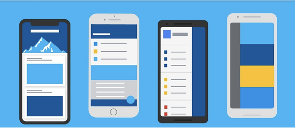
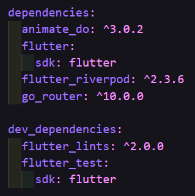

# Flutter Widgets

Una app desarrollada con Flutter para visualizar el funcionamiento de algunos widgets con esta tecnología.

El objetivo de este proyecto es poder mostrar el trabajo realizado con una serie de widgets y así comprender mejor como construir aplicaciones con Flutter.

## Implementaciones 🛠️

Navegación entre pantallas

Nuevos widgets:

* Botones y sus variantes

* botones personalizados

* Tarjetas

* Tarjetas personalizadas

* Align

Rutas:

* Propias de Flutter

* Go_Router

* Paths

* Configuraciones de router:

    * Propio

    * De terceros

RefreshIndicator

InfiniteScroll

ProgresIndicators:

* Lineales

* Circulares

* Controlados

Animaciones

Snackbars

Diálogos

Licencias

Switches, Checkboxes, Radios

Tiles

Listas

Pageviews

## Dependencias 📜

## Diseño 📱

## Recursos 📚

[udemy](https://www.udemy.com/)

## Autor ✒️

- **Jose Llanas** - [jllanas1986](https://github.com/jllanas1986)
